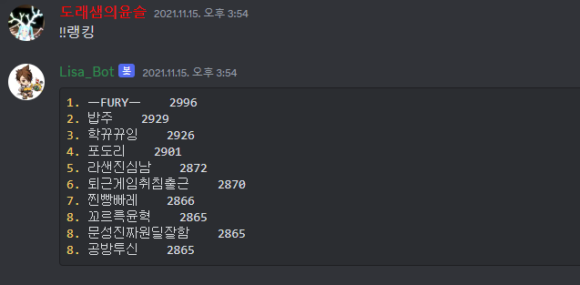
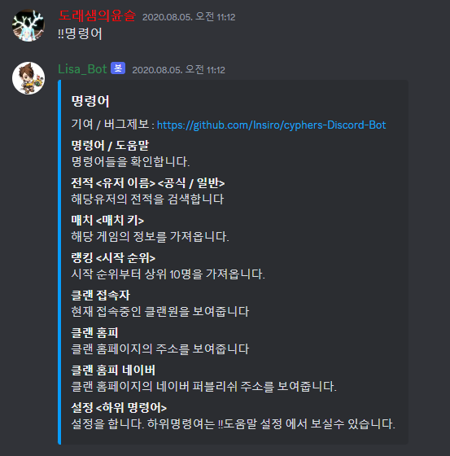
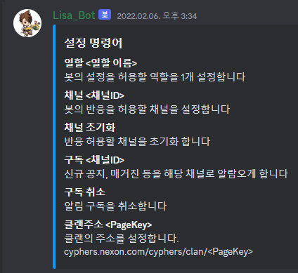
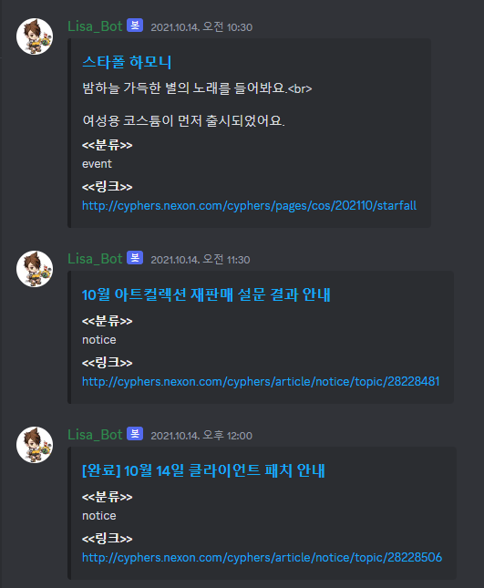
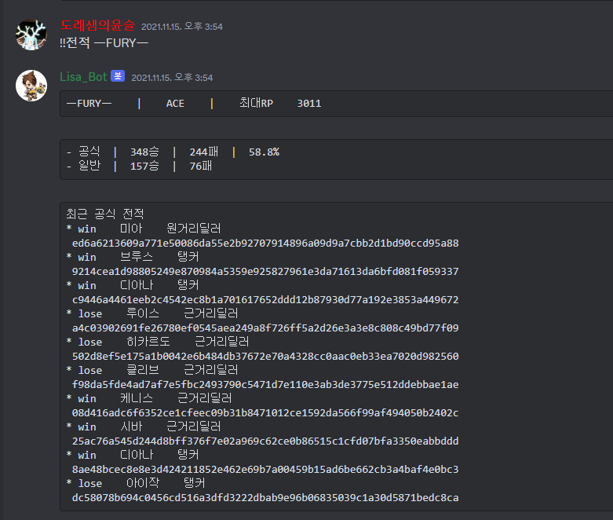
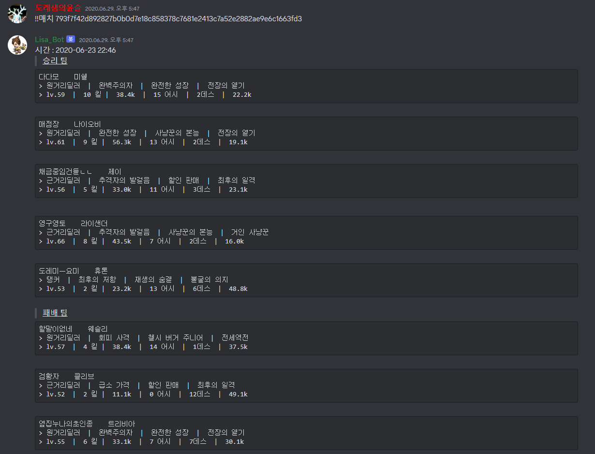
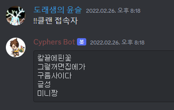
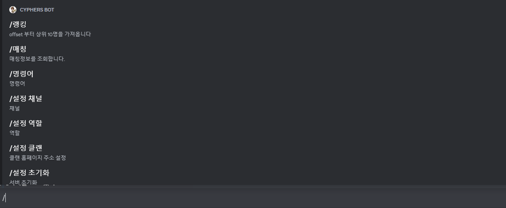

# 사용 예시

`!!명령어` 로 명령어를 호출할 수 있습니다.  
`/명령어` 로 더욱 쉬운 사용이 가능합니다.  

### 랭킹 검색
`!!랭킹` 커맨드를 통해 RP 랭킹을 검색할 수 있습니다.  
  

### 도움말 
`!!명령어` 커맨드를 통해 명령어들에 대한 정보를 볼수 있습니다.  
  
`!!명령어 [subcommand]` 커맨드를 통해 설정의 하위커맨드 들에 대한 정보를 볼 수 있습니다. 

### 뉴스피드
구독 설정을 통해 등록한 채널로 공지사항, 매거진 등의 업데이트 정보가 표시됩니다.  
  

### 전적검색
`!!전적 [닉네임] [공식|일반]` 커맨드를 통해 전적을 검색할 수 있습니다.  
승률 정보와 최근 10개의 전적을 볼수 있습니다.  
함께 주어지는 match id를 통해, 해당 매치정보를 검색할 수 있습니다. 

### 매치검색
`!!매치 [매치id]` 커맨드를 통해 해당 공성전의 매칭 정보를 확인할 수 있습니다.  
유저별 포지션, 특성, 레벨, kda 등의 정보들을 확인할 수 있습니다.

### 클랜 접속자 
`!!클랜 접속자` 커맨드를 통해 현재 접속중인 클랜원 목록을 볼 수 있습니다.  
현재 파싱해오는 클랜 홈페이지의 폐쇄로 사용이 불가능 합니다.  

### 슬래쉬 명령어
슬래쉬 커맨드를 통해 손쉬운 사용 또한 가능합니다.
